# BenzDrive — Enterprise-Grade Secure Cloud Storage Platform

A modern, high-performance cloud storage web application built with **NestJS**, **Next.js**, **TypeORM**, and **AWS S3**, featuring desktop-grade marquee drag-selection, Google Drive-style access control, 2FA authentication, and Terraform Infrastructure as Code.

---

## 🏗️ Architecture Overview

The platform is designed around a multi-tier, decoupled micro-architecture with the frontend hosted on **Vercel Edge Network** (`benzdrive.site`) and backend services running on **AWS** with automated **CI/CD** pipelines and **Terraform** infrastructure provisioning.

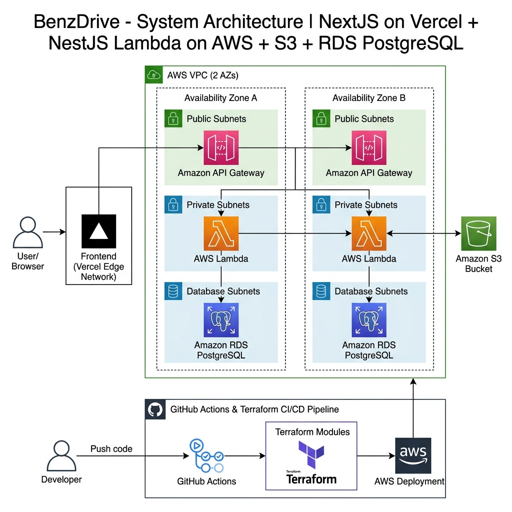

### Key Architectural Concepts:
- **Frontend Tier (Vercel Edge Network)**: Next.js v16 App Router application deployed globally on Vercel Edge Network, offering instant CSR/SSR rendering and custom domain routing (`https://www.benzdrive.site`).
- **Networking (`vpc` module)**: Multi-AZ AWS VPC (`10.0.0.0/16`) spanning public and private subnets across two Availability Zones for high availability and network isolation.
- **API Gateway & Serverless Compute (`lambda` module)**: Amazon API Gateway HTTP API (`aws_apigatewayv2_api`) serving as public HTTPS entry point (`https://api.benzdrive.site`), routing requests to AWS Lambda running NestJS with `@vendia/serverless-express` inside private VPC subnets.
- **Relational Database (`rds` module)**: Amazon RDS PostgreSQL instance running inside dedicated database private subnets, secured via security group rules accepting traffic strictly from Lambda.
- **Object Storage (`s3` module)**: Amazon S3 encrypted bucket configured with CORS rules for direct client downloads and presigned upload URLs.
- **DevOps & IaC**: Modular Terraform configuration (`vpc`, `s3`, `lambda`, `rds`) with remote S3 state storage and GitHub Actions CI/CD deployment.

---

## ✨ Key Features

### 🔒 1. Authentication & Security
- **JWT Cookie Auth**: Secure session management using HttpOnly, SameSite cookies.
- **Two-Factor Authentication (2FA)**: Email verification PIN codes required for extra protection.
- **Password Recovery**: Secure password reset flow with automated token links.

### 🌐 2. Link Sharing & Access Control (Google Drive Model)
- **Restricted by Default**: Generated share links are private (`🔒 Restricted`) until explicitly permitted.
- **General Access Toggle**: Item owners can toggle links between **Restricted** and **Anyone with the link**.
- **Google Drive "You Need Access" Screen**: Uninvited users attempting to open restricted links see a clean permission error view with **Switch Account** and **Go to My Drive** actions.
- **Viewer-Only Enforcement**: Public links grant strict `VIEWER` permissions (Read/Download only). Uploading, editing, and deleting are blocked on the client and server.

### 🖱️ 3. Desktop Marquee Selection & Hotkeys
- **Visual Drag Selection**: 2D rubberband marquee selection box for selecting multiple items simultaneously.
- **Keyboard Hotkeys**: Full support for `Ctrl+A` / `Cmd+A` (Select All), `Esc` (Deselect), and `Shift+Click` range select.
- **Bulk Operations**: Perform batch actions (Star, Download, Trash) across multiple selected items.

### 📤 4. Upload Management & Real-Time Widget
- **Batch Uploads**: Simultaneous upload of multiple files and structured folder trees.
- **Floating Upload Widget**: Google Drive-inspired bottom progress widget showing real-time upload progress, file sizes, speed, and status checks.

### 📁 5. Directory Tree & File Operations
- **Nested Folder Structure**: Unlimited subfolder nesting with dynamic breadcrumbs navigation.
- **Soft-Delete Recovery**: Dedicated **Trash Bin** with permanent delete or item restoration options.
- **Starred & Recent Items**: Quick-access filters for starred documents and recent user activity.

---

## 📸 Screenshots & Workflow

### 1. Two-Factor Authentication (2FA) Verification
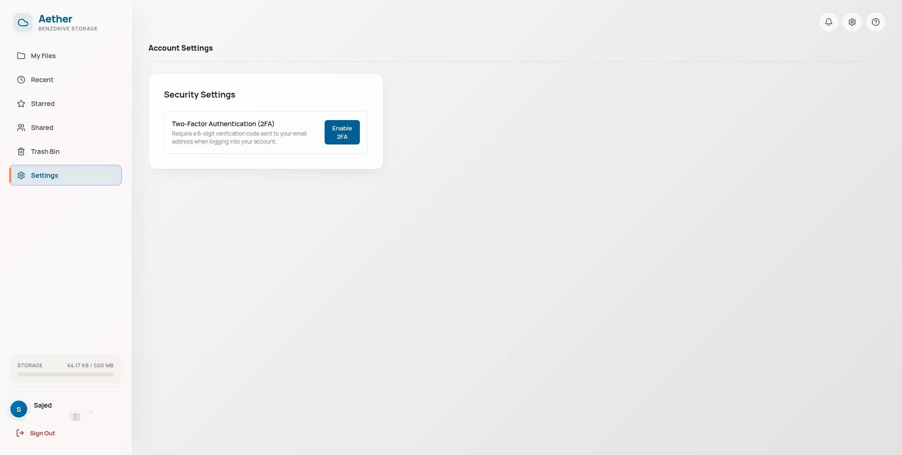

### 2. Main Dashboard & Desktop File Explorer
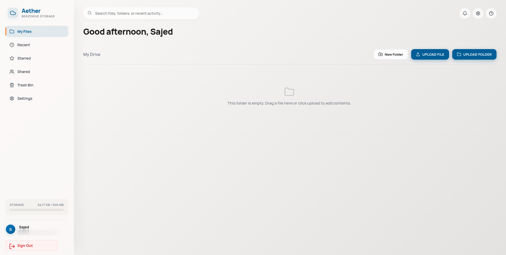

### 3. File Uploading & Real-Time Progress Widget
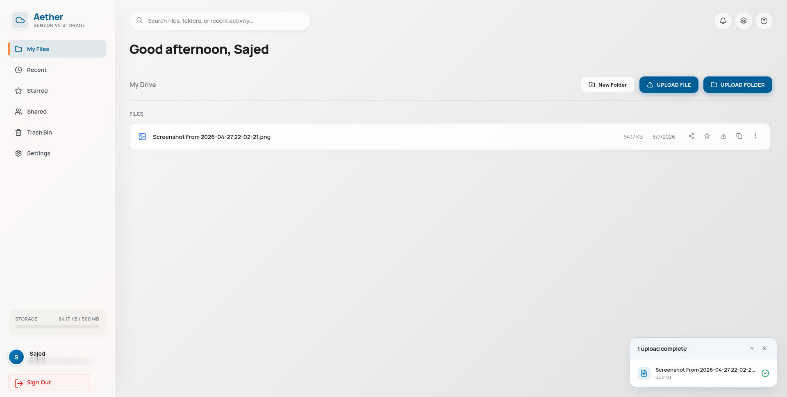

### 4. Share Modal & Access Control Settings
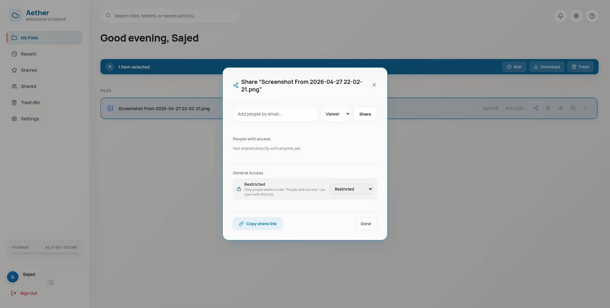

### 5. "You Need Access" Screen (Restricted Link View)
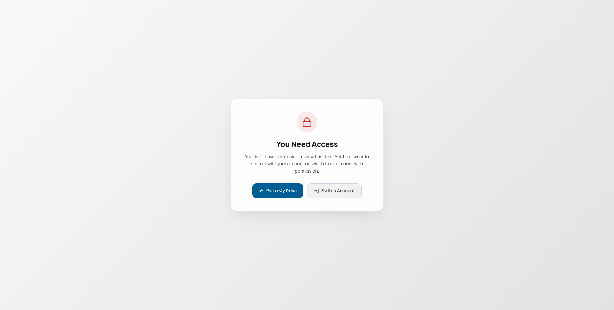

### 6. Starred Items & Favorites View
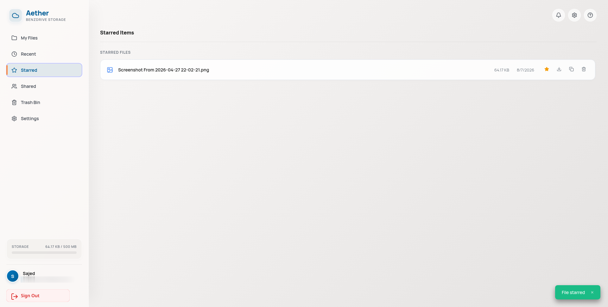

### 7. Trash Bin & Soft-Delete Recovery
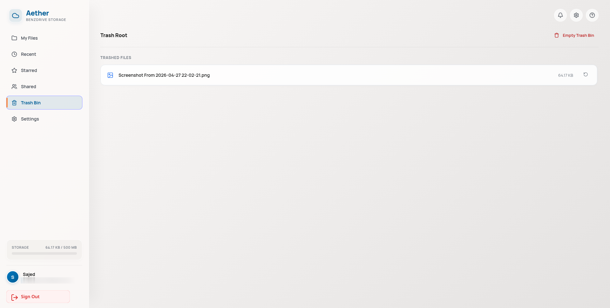

---

## 🛠️ Technology Stack

| Layer / Domain | Technology | Description |
| :--- | :--- | :--- |
| **Frontend Framework** | [Next.js v16](https://nextjs.org/) | React 19 App Router with SSR/CSR hydration |
| **Frontend Hosting** | [Vercel](https://vercel.com/) | Global Edge Network deployment (`https://www.benzdrive.site`) |
| **Styling & Icons** | CSS Modules + [Lucide React](https://lucide.dev/) | Premium glassmorphism design system & SVG vector icons |
| **Backend Framework** | [NestJS v11](https://nestjs.com/) | Enterprise Node.js TypeScript Framework |
| **Serverless Adapter** | `@vendia/serverless-express` | NestJS wrapper for AWS Lambda execution |
| **Authentication & Mail** | Passport JWT + Nodemailer | HttpOnly cookie auth, bcrypt hashing & 2FA email codes |
| **ORM & Database** | [TypeORM](https://typeorm.io/) + PostgreSQL 16 | Relational data mapping & Amazon RDS PostgreSQL |
| **Cloud Storage** | AWS S3 SDK v3 (`@aws-sdk/client-s3`) | Direct S3 multi-file uploads & presigned URLs |
| **Serverless Compute** | AWS Lambda (Node.js 20) | Scalable VPC-isolated backend compute execution |
| **API Gateway** | Amazon API Gateway HTTP API | Public HTTP proxy entry point & custom domain routing |
| **Infrastructure as Code** | [Terraform v1.7+](https://www.terraform.io/) | Modular IaC (`vpc`, `s3`, `lambda`, `rds`) |
| **CI/CD Automation** | GitHub Actions | Push-to-deploy workflows & automated state management |

---

## ⚙️ GitHub Actions CI/CD Pipelines

BenzDrive utilizes automated **GitHub Actions** workflows (`.github/workflows/`) for zero-downtime continuous integration and infrastructure management.

### 1. Full CI/CD Workflow Pipeline Structure
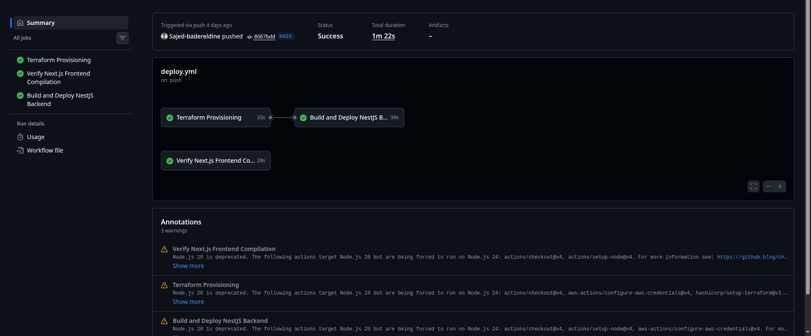

### 2. Production Deployment Workflow (`deploy.yml`)
Triggered automatically on every push to the `main` branch:

#### A. Job 1: Terraform Provisioning (`terraform`)
Automatically initializes remote S3 state bucket (`${bucket_name}-tfstate`), validates, and executes `terraform apply -auto-approve` to provision VPC, S3, RDS, and Lambda resources.

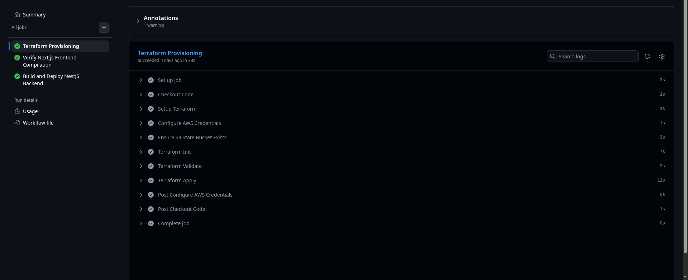

#### B. Job 2: Backend Lambda Deployment (`backend-deploy`)
Compiles NestJS TypeScript application, packages production bundle (`npm install --omit=dev`), and deploys directly to AWS Lambda (`benzdrive-backend`) via `aws lambda update-function-code`.

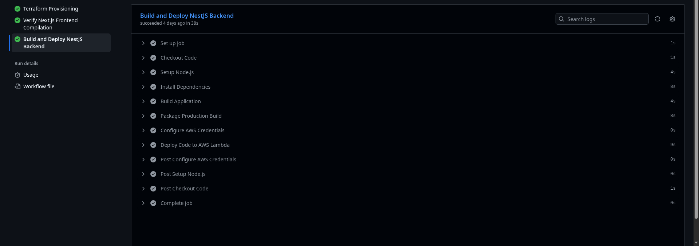

#### C. Job 3: Frontend Compilation Check (`frontend-check`)
Verifies production Next.js build integrity (`npm run build`) to ensure zero build errors before release.

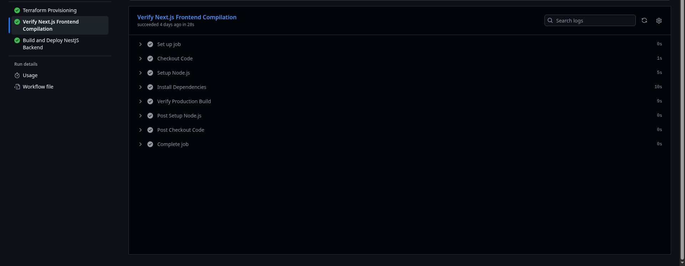

### 3. Infrastructure Teardown Workflow (`destroy.yml`)
Manual dispatch workflow allowing quick teardown of all AWS resources (`terraform destroy -auto-approve`) for cost management and dev testing.

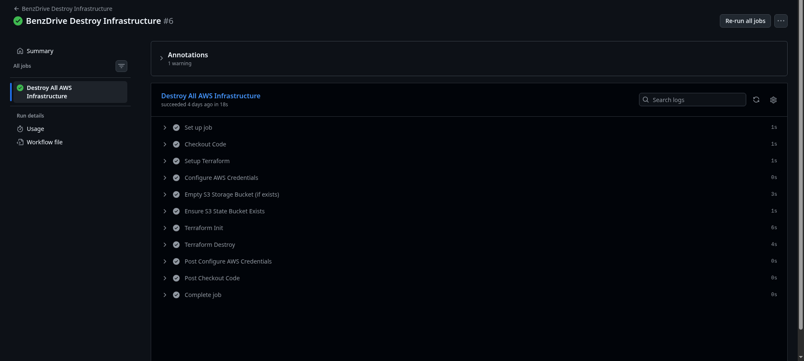

---